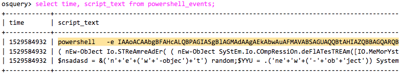
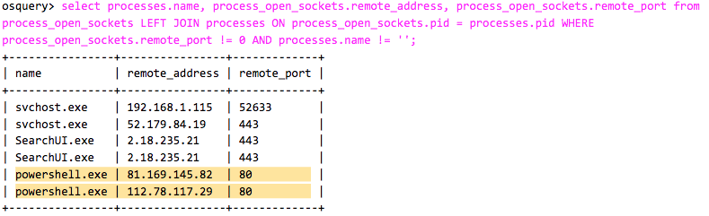
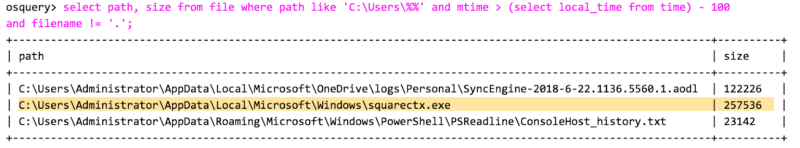
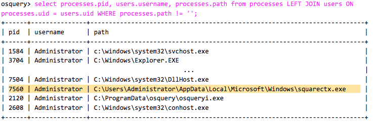
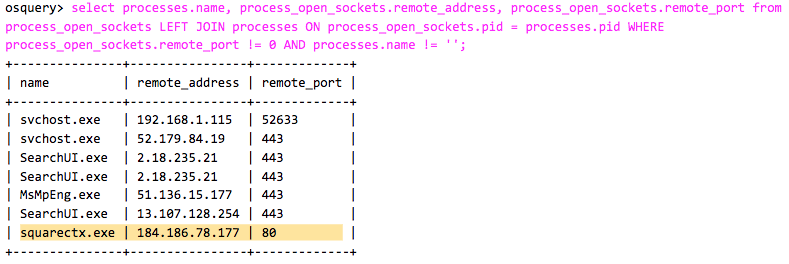

Kurumlarda SOC yöneticileri ile konuşurken sistemlerinde Osquery ve Sysmon kullanılıp kullanılmadığını öğrenmek isterim. Sysmon'u uzun zamandır duyuyorsunuzdur fakat Osquery sizlere biraz yabancı gelmiş olabilir. Osquery Facebook tarafından geliştirilmiş olan açık kaynak kodlu bir yazılımdır ve sistemler üzerinde zararlı olayları analiz etmek için kullanıyoruz. Osquery ve sysmon sistemler üzerindeki anormallikleri kolaylıkla tespit etmemizde bizlere çok yardımcı oluyor. Bu araçları SIEM yazılımları ile bir arada kullanamak SIEM yazılımlarının yeteneklerini geliştirdiği aşikardır.

Bu yazıda bu iki yardımcı araçtan yararlanarak bir analizi nasıl yaparız bunu göreceğiz. Emotet isimli Bankacılık alanlarına yönelik saldırılar gerçekleştiren zararlıyı inceleyeceğiz. Buradan [ANY.RUN] ve [VİRUSTOTAL] analizini inceleyebilirsiniz.

[ANY.RUN] üzerinden yapılan analizi incelediğimizde Word dosyası içerisinde yer alan macro komutunun çalıştırıldığı görülüyor. Macro asıl zararlı aktiviteleri gerçekleştirmek için bir powershell komutu çalıştırıyor.

## İnceleme Vakti!

`
select time, script_text from powershell_events;
`
Komutu sistem üzerinden çalıştırılmış olan powershell komutlarını ve komutların çalıştırıldıkları tarihleri listeler.

Burada Osquery hakkinda biraz daha bilgi vermem gerekiyor. Osquery komutları alışkın olduğunuz SQL komutlarına benzer. SQL komutları içerisinde ne çok işe yarayan komutlardan biri olan `JOIN` burada bize yardımcı olacak.

Osquery modüllerinden birisi olan `process_open_sockets`'i burada kullanacağız.

Powershell komutu payload'ı indirdiğinde, Osquery ile hangi ip adresine ve hangi porta bağlandığını görebiliriz.

`
select processes.name, process_open_sockets.remote_address, process_open_sockets.remote_port from process_open_sockets LEFT JOIN processes ON process_open_sockets.pid = processes.pid WHERE process_open_sockets.remote_port != 0 AND processes.name != '';
`

Powershell komutunun indirdiği dosyayı nereye ve ne zaman yazdığını görmek bizim için harika olabilir. Bunu öğrenebilmek için Osquery'i kullanabiliriz. Çok fazla dosya listeleneceğinden ötürü bunları ayrıştırmamız gerekiyor. Biz yazdığımız komut ile 100 saniye içerisinde oluşturulmuş olan dosyaları listeleyerek bu listeyi küçülteceğiz.

`
select path, size from file where path like 'C:\Users\%%' and mtime > (select local_time from time) - 100 and filename != '.';
`

Powershell komutunun indirmiş olduğu dosyayı bulduk. Şimdi çalıştırılan processleri görelim. Hangi kullanıcı tarafından çalıştırıldığını görmek için yukarıdaki gibi bir JOIN kullanarak daha temiz bir sonuç listesi elde debiliriz.

`
select processes.pid, users.username, processes.path, from processes LEFT JOIN users ON processes.uid WHERE processes.path != '';
`

Artık Emotet'in sistem üzerinden çalıştığını ve muhtemelen kötü şeyler yaptığını biliyoruz. Emotet'in içeride çalışan yazılımı olan `squarextx.exe`
 nin hangi IP adresine ve porta bağlandığını görmemiz gerekiyor.

`
select processes.name, process_open_sockets.remote_address, process_open_sockets.remote_port from process_open_sockets LEFT JOIN processes ON process_open_sockets.pid = processes.pid WHERE process_open_sockets.remote_port != 0 AND processes.name != '';
`

Yazıyı çok basite seviyede tuttuk. Osquery ile bir olay incelemesi nasıl yapılabilir bunun biraz görebildik.

### AlienVault ile Osquery'i Nasıl Kullanırız?

Osquery ile sistemde olay incelemesi yapabildiğimiz gibi EDR olarak da kullanabiliriz. Günümüzde EDR güvenlik ürünlerinin olmazsa olmazlarından. Ücretsiz ve güçlü bir EDR'ı Alinevault bizlere sunuyor. AlienVault OTX'de Tehdit Avcılığı yapmak için Osquery'den yararlanıyor.

2018 Yılının Nisan ayında artık OTX ücretsiz bir EDR çözümü sundu. Bu EDR'ı kullanarak OTX içerisinde yer alan tüm analizlerin IoC verileri ile taramalar yapılabilmektedir. EDR aracılığı ile dünyanın en büyük açık istihbarat platformu olan OTX'in IoC verileri ile sistemde zararlı dosyalar rahatlıkla tespit edilebilmektedir.

[OTX Emotet] adresinden Emotet için oluşturulmuş olan IoC'lara ulaşabilirsiniz.

### Kaynaklar

* [EDR-1]
* [EDR-2]
* [OSQUERY]

[ANY.RUN]: https://app.any.run/tasks/b30d3215-a238-415e-ba7d-a884e1505758
[VİRUSTOTAL]: https://www.virustotal.com/gui/file/c932d54a9ef3c645a28b7d8de9747fc6c06fc23c6d65c036da4eae4d778a81db/detection
[OTX Emotet]: https://otx.alienvault.com/browse/pulses?q=emotet

[EDR-1]: https://www.alienvault.com/resource-center/solution-briefs/endpoint-detection-and-response
[EDR-2]: https://www.alienvault.com/blogs/security-essentials/new-free-threat-hunting-service-from-alienvault-otx-endpoint-security
[OSQUERY]: https://blog.rapid7.com/2016/05/09/introduction-to-osquery-for-threat-detection-dfir/