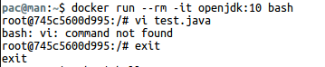
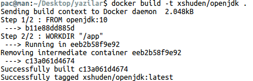
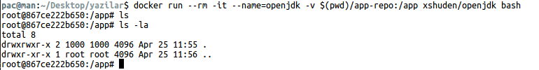
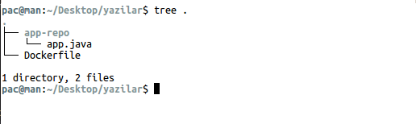
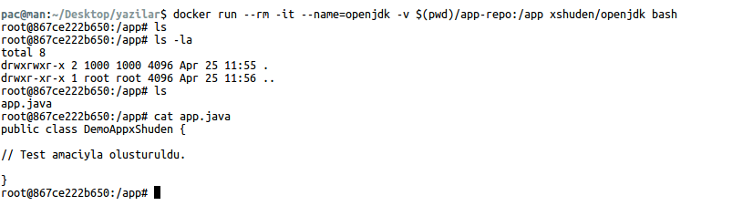
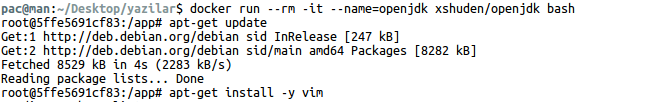
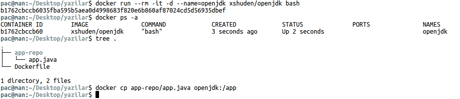

Docker ile çok fazla kullanıyorsanız ve konteyner içerisinde bir dosyayı düzenlemek ve özellikle oluşturmak istediğinizde `bash: <EDITOR_NAME>: command not found` hatasını mutlaka görmüşsünüzdür. 

### Neden? 

Bu hatayı neden alıyoruz. Docker bulunmadan önce Vagrant kullanılıyordu. Vagrant kullanmak Docker kadar olmasada hoşuma gidiyor. Vagrant box dosyalarının  boyutları Docker imajlarına göre çok daha fazladır. Docker imajlarının boyutlarını çok küçük olmasının nedeni ise imaj içerisinde sadece gerekli olan paketlerin bulunmasından ötürüdür. İmajların boyutularının neden küçük olduğunu anladıysak buradan şunuda anlayabiliriz. Gerekli olan paketler içerisinde bir editör programının yer alması anlamsız ve gereksizdir. Bir imaj hazırladıysanız veya bir imajı konteyner olarak çalıştırdıysanız aşağıdaki gibi bir hata ile karşılaşmış olursunuz:

```bash
pac@man:~$ docker run --rm -it openjdk:10 bash
root@745c5600d995:/# vi test.java
bash: vi: command not found
root@745c5600d995:/# 
```



### Nasıl Çözeriz?

#### 1- Volume Kullanmak

Aşağıda oluşturduğumuz `Dockerfile` dosyasını görebiliriz.

```docker
FROM openjdk:10

WORKDIR "/app"
```

Yukarıda yer alan `Dockerfile` dosyasını şu şekilde imaj haline getirebiliriz.

```
docker build -t xshuden/openjdk .
```



Oluşturduğumuz imaja `Volume` tanımlayarak fiziksel cihazımızda yer alan dosyayı konteyner içerisine rahatlıkla aktarabiliriz.

```
docker run --rm -it --name=openjdk -v $(pwd)/app-repo:/app xshuden/openjdk bash
```

Bulunduğunuz dizinde yer alan `app-repo` klasör ile konteyner içerisinde oluşturulan `/app` klasörü arasında bir bağlantı sağladık. `/app` klasörünün otomatik olarak konteyner içerisinde oluşturulur. 



Konteyner çalıştığında hemen `/app` dizininde çalışmaya başladığını görebilirsiniz. `/app` dizini içerisine herhangi bir dosya aktarmadığımız için dizini boş olarak göreceğiz. Fiziksel cihazımızda bulunan `app-repo` klasörüne bir dosya oluşturarak bunu konteyner içerisine aktarabiliriz.

Burada Fiziksel cihazımızda yer alan dosyaları görebilirsiniz.



Konteyner içerisinde dosyamızı gördük ve dosyayı okudu.



#### 2- Editör İndirmek

Konteyner içerisinde dosya düzenlemenin bir diğer yolunda fiziksel makinelerimizde kullandığımız editörlerdir. Editör kurma seçeneğini ikinci seçenek olarak verme nedenim docker imajlarının ve konteynerlerinin mümkün olduğunca düşük boyutlara sahip olmaları gerektiği içindir. Yukarıda bahsettiğim gibi Docker'ın hızlıca kullanıma hazır ortamlar sunabilmesi  Bir konteyner oluşturalım ve bu konteyner'a nasıl editör kurabiliriz görelim.

```
docker run --rm -it --name=openjdk xshuden/openjdk bash
```

Aşağıda yer alan komutlar ile konteyner içerisine `vim` editörünü kurabiliriz.
3
```bash
root@5ffe5691cf83:/app# apt-get update
root@5ffe5691cf83:/app# apt-get install -y vim
```



Yukarıdaki şekilde konteyner oluşturulduktan sonra editörü yükleyebilirsiniz. 
Docker ile oluşturacağınız her konteynerde editöre ihtiyaç duyabilirsiniz. Böyle bir ihtiyacını olursa editör yükleme işlemini `Dockerfile` dosyası içerisinde yaparak imaj haline getirmeniz daha iyi olacaktır.

```docker
FROM openjdk:10

RUN ["apt-get", "update"]
RUN ["apt-get", "install", "-y", "vim"]

WORKDIR "/app"
```

Yukarıda yer alan `Dockerfile` dosyasını build ederek artık oluşturacağınız tüm imajlarda `vim` kurulu olarak gelecektir.


#### 3- Docker Copy Komutu

Kullanabileceğimiz diğer bir seçenek ise Docker'ın bizlere sunduğu 'copy' komutu. 

İlk örnekte oluşturduğumuz imajı konteyner olarak oluşturup çalıştıralım.

```
docker run --rm -it -d --name=openjdk xshuden/openjdk bash
```



`docker cp app-repo/app.java openjdk:/app` komutu ile oluşturduğumuz dosyayı konteyner içerisine aktarabiliriz.


### Kaynaklar

* [Docker CP]

[Docker CP]: https://docs.docker.com/engine/reference/commandline/cp/